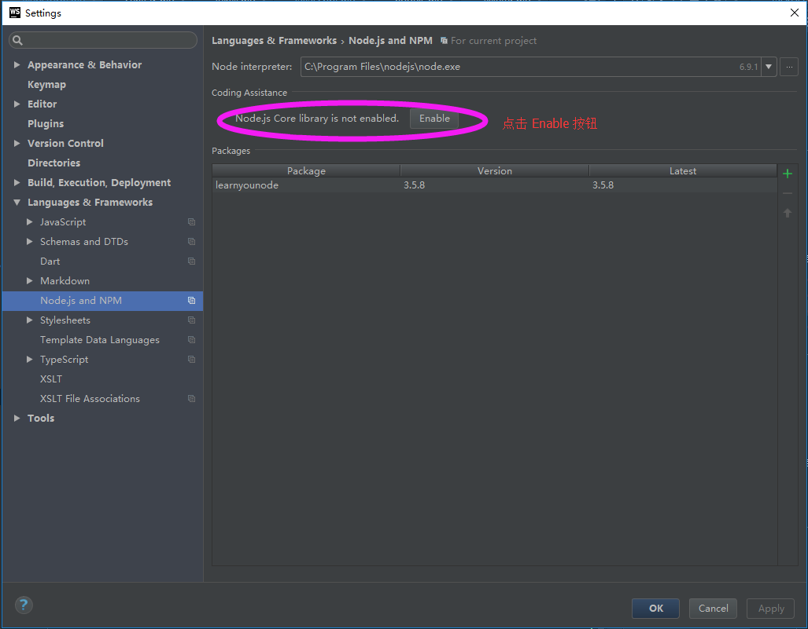

# 参考资料
- http://frontenddev.org/column/introduction-to-webstorm/

# 视频课程
- 51CTO 上无此类课程
- 极客学院和慕课网有这类课程，不过都特别简单

# 快捷键
- 参考资料：https://my.oschina.net/powertoolsteam/blog/796156
- 新建文件或目录：Ctrl + Alt + Ins 
- 打开命令行终端：Alt + F12
- require 表达式：Ctrl + Alt + V
- 完成当前表达式：Ctrl + Shift + Enter
- 删除行：Ctrl + X（复制行到剪贴板），Ctrl + Y（不复制到剪贴板）
- 复制整行：Ctrl + D

# 环境设置
- 设置编辑器代码自动换行，避免水平滚动
  File，Settings，Editor，General，Soft Wraps，Use soft wraps
- 设置光标的形状，默认竖线改为 block
- 设置光标的颜色，默认白色改为绿色
- 设置编辑器的主题色，默认白色改为黑色
- 设置字体大小，默认 11 改为 14
- File -> settings -> Directories -> Add Content Root 中添加你当前的工程目录。
  用来打开多个项目，貌似不太完美，Git 好像不能用。

# Node.js Development Workflow in WebStorm  中的技术
- 视频地址：https://www.youtube.com/watch?v=xuXIBSa_7j4&list=LLb4RKByoKxlPiG5mB-q4mkA
- 工作流：
  在 Github 上重建空白仓库，添加并修改 gitignore 文件，从 webstorm 直接克隆该项目，增加代码。
  - VCS ->  Checkout from Version Control -> Github 可以直接从 Github Clone 仓库
  - 在 Github 上创建仓库的时候选择 .gitignore 文件的时候，选择 node，会把 node_modules 排除，自己再增加一个 .idea 文件夹把 webstorm 的文件夹排除，就 OK 了
- 配置项目设置，运行之后，会自动打开浏览器浏览网站，并且访问具体的端口号都有了  
- 打开命令行终端，在命令行终端，运行 npm 命令进行项目依赖项的安装，以及其他

# 其他技术
- 在当前项目中增加引用库的方法代码补全，File -> Settings -> Languages & Frameworks -> （回头补上，不过貌似 utility 库没有补全的配置文件）

# express 资料
- http://www.expressjs.com.cn/

# 教程
- https://my.oschina.net/klausgao/blog/380351

# 2017年1月9日 解决了几个问题
- 问题 1 描述：Github 建了 learnyounode 仓库，webstorm 中克隆了该仓库，直接添加 step01.js 文件，做 learnyounode 的闯关任务，写 console.log 都没有正确的智能感知。感觉是库没有加上。  
  不知道加什么库。尝试解决一下，建了一个web express 的框架，发现他的库里有 predefined node core 库，我的没有，怎么加上呢？查 webstorm 的官方帮助文档，找到了解决办法。如下图所示：  
  
  
- 问题 2 描述：learnyounode 的第二个任务开始操作命令行参数了，程序逻辑开始有些复杂了，这个时候有两种方式：一、直接在终端上执行程序，可以在命令行给参数，但是不利于程序调试。二、开启调试模式运行，这个时候需要设置命令行参数。设置的办法如下：